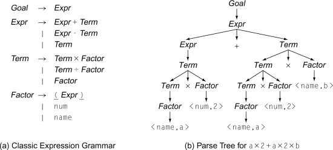
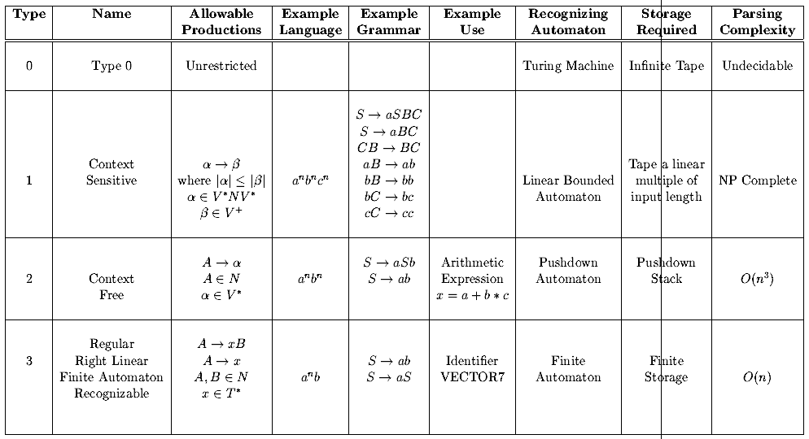
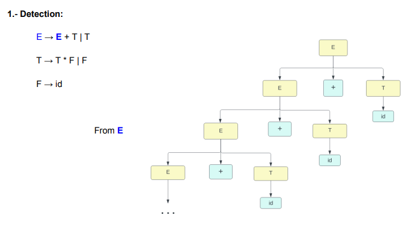
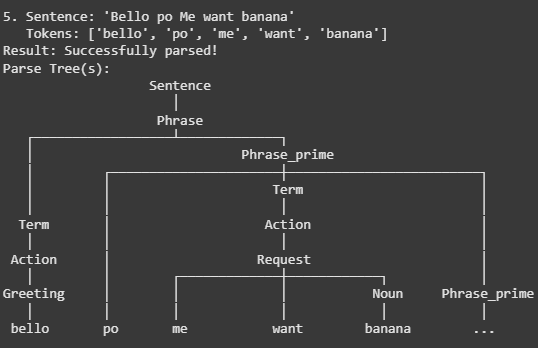

# Evidence: 2 Generating and Cleaning a Restricted Context-Free Grammar

Mateo Minghi - A01711231

---

Put simply, a grammar is a set of rules from which we can derive strings. Grammars have implications in
determining the syntactic correctness of language[1], and are mostly used for parsing and interpreting programming languages.

Form: ψ → ω, where ψ and ω are strings.

They can be represented as trees:



Each branch corresponds to one rule. The mother of each branch corresponds to ψ and the
daughters to ω. The elements at the very ends of branches are referred to as terminal elements,
and the elements higher in the tree are all non-terminal elements.

Compilers use grammars to parse code. This involves checking if the code follows the grammatical rules and organizing it into a structured form. They also perform semantic analysis, which verifies if the code makes logical sense based on the language's rules. Thus, grammars are a fundamental concept for coputer scientists to understand.[2]

Grammars are categorized based on their complexity and the types of languages they can describe. Based on Noam Chomsky's work, there are 4 types of grammars, displayed on the image below[3]:



- Type 0 : Complex Math theories
- Type 1 : Natural Languages (ambiguity\*)
- Type 2 : Programming Languages (no ambiguity)
- Type 3 : Identifiers

\*In this context, we undertand ambiguity as being able to generate multiple parse trees for the same input string, leading to uncertainty in the interpretation of the language.

### Context Free Grammars

These are grammars whose rules can be applied to a nonterminal symbol (symbols that define the structure or rules of a language) regardless of its context.

---

## Minionese

I chose the Minion Language, popularly known as Minionese, for my project. Minionese is a fictional language which borrows words and grammatical rules from many different languages (English, Spanish, Italian, Chinese, French and more).

There are several articles available analyzing Minionese in depth, for the puporses of this project, I'm basing my grammar on this article: https://despicableme.fandom.com/wiki/Minionese

**Minion Language Terminals (T):**

T: { Bello, Papaya, Me, want, banana, bapple, Po }

**Minion Language Non-Terminals (N):**

N: { Sentence, Phrase, Action, Noun, Greeting, Farewell }

Once we have identified the core terminals and non-terminals of the language, we can define the production rules.


For simplicity, I stablished the following rules:

```
Sentence -> Phrase
Phrase -> Phrase 'Po' Phrase | Action
Action -> Greeting | Farewell | 'Me' 'want' Noun
Greeting -> 'Bello'
Farewell -> 'Papaya'
Noun -> 'banana' | 'bapple'
```

Sentence will be the starting point for generating any valid string in the language. It's a common convention in computer science to use a descriptive name like 'Sentence' as the start symbol.

The next step is to remove ambiguity. As I explained earlier, ambiguity is when we can generate multiple parse trees for the same input string. We must remove ambiguity to avoid confusion about the structure or meaning of that string. This is vital for compiler design.

Based on our symbols and production rules, we can create a sentence like "Bello Po Me want banana Po Papaya". However, this string can be parsed in more than a single way, resulting in different syntactic trees

Tree 1 (generated using chatgpt)

```
graph TD
    subgraph Tree 1
        S(Sentence) --> P1(Phrase)
        P1 --> P2(Phrase)
        P1 --> T1(Po)
        P1 --> P3(Phrase)
        P2 --> P4(Phrase)
        P2 --> T2(Po)
        P2 --> P5(Phrase)
        P4 --> A1(Action)
        A1 --> G(Greeting)
        G --> T3(Bello)
        P5 --> A2(Action)
        A2 --> T4(Me)
        A2 --> T5(want)
        A2 --> N1(Noun)
        N1 --> T6(banana)
        P3 --> A3(Action)
        A3 --> F(Farewell)
        F --> T7(Papaya)
    end
```

Tree 2 (generated using chatgpt)

```
graph TD
    subgraph Tree 2
        S(Sentence) --> P1(Phrase)
        P1 --> P2(Phrase)
        P1 --> T1(Po)
        P1 --> P3(Phrase)
        P2 --> A1(Action)
        A1 --> G(Greeting)
        G --> T2(Bello)
        P3 --> P4(Phrase)
        P3 --> T3(Po)
        P3 --> P5(Phrase)
        P4 --> A2(Action)
        A2 --> T4(Me)
        A2 --> T5(want)
        A2 --> N1(Noun)
        N1 --> T6(banana)
        P5 --> A3(Action)
        A3 --> F(Farewell)
        F --> T7(Papaya)
    end
```

We can introduce an intermediate non-terminal to eliminate the ambiguity, and rewrite our production rules:

T: { Bello, Papaya, Me, want, banana, bapple, Po }

N: { Sentence, Phrase, Term, Action, Noun, Greeting, Farewell }

```
Sentence -> Phrase
Phrase -> Phrase 'Po' Term | Term (Modified: Enforces left-associativity)
Term -> Action (New rule)
Action -> Greeting | Farewell | 'Me' 'want' Noun
Greeting -> 'Bello'
Farewell -> 'Poopaye'
Noun -> 'banana' | 'bapple'
```

With this change, if we were to parse the same string "Bello Po Me want banana Po Poopaye", we would only get a single tree.

In the context of computer science, Syntax Analysis or Parsing checks whether the given input is in the correct
syntax. The main goal of syntax analysis is to create a parse tree. Once the parse tree is constructed, the compiler can perform semantic analysis to check if the source code makes sense and follows the semantics of the programming
language, but im getting ahead of myself.

For syntax analysis, we can use the Left Left look ahead 1 parser LL(1). This is a deterministic parser.

- Before making the parser, we must first check the grammar for left recursion and remove it.

Left recursion is formally described as a production rule of the form A→Aα, where 'A' is a non-terminal symbol and 'α' is any sequence of terminal and/or non-terminal symbols. Essentially, the rule defines 'A' in terms of itself as the first symbol on the right side.[4]

This image makes it clearer:



One of our rules (Phrase -> Phrase 'Po' Term | Term) fits the form of a left recursion A→Aα.

To eliminate it, we must substitute the productions presenting the left recursion, with two new productions, where
the first element will be a terminal and use an intermediate state A' which can derive to an empty string ε.

Replace A→Aα∣β with the two new rules:

- A→βA′

- A′→αA′∣ϵ

Applying this to our rule:

- A=Phrase

- A′=Phrase′

- α=’Po’ Term

- β=Term

So our grammar would finally look like this:

```
Sentence -> Phrase
Phrase -> Term Phrase' (New rule)
Phrase' -> 'Po' Term Phrase' | ε (New rule)
Term -> Action
Action -> Greeting | Farewell | 'Me' 'want' Noun
Greeting -> 'Bello'
Farewell -> 'Papaya'
Noun -> 'banana' | 'bapple'
```

## Parsing testing

For testing, I wrote a script using the NLTK library, using the Recursive Descent Parser. While not exactly an LL(1) parser, it's a top-down parser, that does not allow for ambiguity or left recursion, and has a similar approach to LL(1).

To run it:
https://colab.research.google.com/drive/1rYmDe59Jh0CrQigJTmpA_YHKszHi72GB?usp=sharing

And it works! Meaning that we properly designed the grammar for the language



Just for the love of the game, I also wrote a script using the Lark library, which uses the Earley algorithm. It can handle all context-free grammars, including those with ambiguity and left recursion. (EarleyAlgorithmParser.ipynb)

Further testing results can be found on both jupyter notebooks

## Grammar Classification

Based on the Chomsky Hierarchy described earlier, our grammar, before and after checking for ambiguity and left recursin, is classified as a **Context-Free Grammar (CFG)** or **Type 2 Grammar**.

This grammar allows us to formally define and parse sentences in the Minion language.

---

References

[1] https://www.geeksforgeeks.org/introduction-to-grammar-in-theory-of-computation/

[2] https://medium.com/@georgeishaq321321/context-free-grammars-in-compilers-ba4e01b4b26e

[3] https://www.cs.utexas.edu/users/novak/cs381k288.html

[4] https://www.sciencedirect.com/topics/computer-science/left-recursion#:~:text=Left%20recursion%2C%20in%20the%20context,form%20that%20begins%20with%20itself.

---

"STC0101 - Implementación de algoritmos computacionales"

- The implementation of the algorithms works correctly
- The program includes automated tests that show the algorithm works properly
- both: best practices and correct style are followed in the implementation

"STC0102 - Optimización de algoritmos computacionales"

- The complexity of the grammar is analyzed with chomsky hierarchy both before and after cleaning the grammar
- A detailed step by step explanation shows how ambiguity was removed in this grammar
- A detailed step by step explanation shows how left recursion was removed in this grammar

"STC0103 - Generación de modelos computacionales"

- Syntactic Trees are presented for the grammar
- A complete explanation with examples of several senteces is presented to explain what kind of sentences could be produced with this grammar
- The explanation contains the theoretical/mathematical backing for the ideas presented in the model, references must be included.

"STC0104 - Implementación de modelos computacionales"

- The implementation of the model is consistent with the documentation generated.
- The Implemented model also contains a set of clear automatred and documented tests, to show that the model works as intended and correctly solves the problems
- The program passes successfully all the tests
